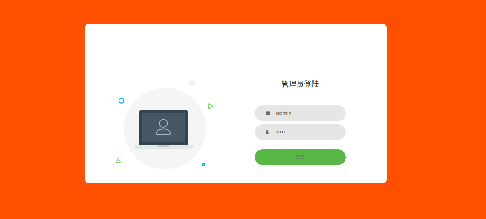

# 项目设计部分：

## 项目总体构成；


## 引入的包在项目中的作用相关说明；

express后台框架 mongodb数据库 nodejs npm install

## 项目目录结构和各个部分的说明。

client目录中存放的是css和页面等文件


models中为数据库文件

```javascript
const mongoose = require('mongoose');

// Book Schema
const bookSchema = mongoose.Schema({
	title:{
		type: String,
		required: true
	},
	genre:{
		type: String,
		required: true
	},
	description:{
		type: String
	},
	author:{
		type: String,
		required: true
	},
	publisher:{
		type: String
	},
	pages:{
		type: String
	},
	image_url:{
		type: String
	},
	buy_url:{
		type: String
	},
	create_date:{
		type: Date,
		default: Date.now
	}
});

const Book = module.exports = mongoose.model('Book', bookSchema);

// Get Books
module.exports.getBooks = (callback, limit) => {
	Book.find(callback).limit(limit);
}

// Get Book
module.exports.getBookById = (id, callback) => {
	Book.findById(id, callback);
}

// Add Book
module.exports.addBook = (book, callback) => {
	Book.create(book, callback);
}

// Update Book人
module.exports.updateBook = (id, book, options, callback) => {
	var query = {_id: id};
	var update = {
		title: book.title,
		genre: book.genre,
		description: book.description,
		author: book.author,
		publisher: book.publisher,
		pages: book.pages,
		image_url: book.image_url,
		buy_url: book.buy_url
	}
	Book.findOneAndUpdate(query, update, options, callback);
}

// Delete Book
module.exports.removeBook = (id, callback) => {
	var query = {_id: id};
	Book.remove(query, callback);
}

```

app.js运行整个项目，连接数据库，并且设置端口

端口号为10822

# 使用说明书：每个功能的使用方法

登陆：

管理员账号为admin

密码：admin



商品管理


点击商品管理可进行管理


点击上架，上架商品

点击查看


点击购买按钮可实现购买


点击编辑或清空

